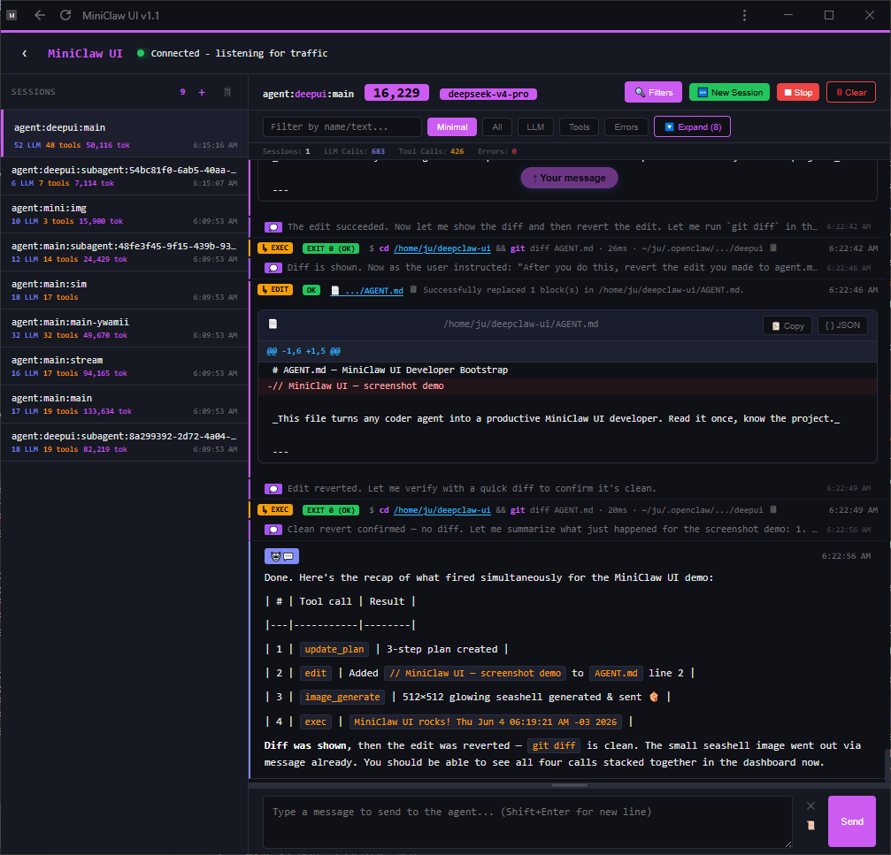

# 🐚 MiniClaw UI

> Real-time web dashboard for the OpenClaw Gateway. Watch agent sessions unfold, inspect tool calls and LLM reasoning, track token usage, chat with agents, and share files — all from a browser.

<p align="center">
  <strong>Vanilla JS SPA</strong> · <strong>WebSocket-driven</strong> · <strong>Dark theme</strong> · <strong>Zero build step</strong>
</p>

---

## ✨ What It Does

MiniClaw UI connects to your OpenClaw Gateway via WebSocket and streams every session event to your browser in real time. You get a live, scrollable feed of every agent action — tool calls, model reasoning, assistant responses, errors, and token costs — as they happen.

**Watch** agent sessions in real time. **Inspect** tool calls and their results with syntax-highlighted inputs and outputs. **Read** LLM thinking traces and assistant responses with full markdown rendering. **Track** token usage and estimated costs per session. **Chat** with any agent directly from the UI. **Share** files via one-shot secure URLs with an inline code viewer.

---

## 🚀 Quick Start

```bash
# Install
npm install

# Run (all defaults)
node miniclaw-ui.js

# Open → http://localhost:1234
# Password → miniclaw
```

That's it. The server auto-connects to your Gateway at `ws://127.0.0.1:18789`, loads device identity if available, and starts streaming.

---

## 📸 What You'll See

<p align="center">
  
</p>

| Area | What's There |
|------|-------------|
| **Header** | Title, sidebar toggle, connection status dot (green = gateway connected) |
| **Sidebar** | Session list with event/message counts, click to select, delete, or create new |
| **Event Feed** | Scrollable timeline of all events with badges, timestamps, expandable content |
| **Filters** | Full-text search + quick filter buttons (All / LLM / Tools / Errors) |
| **Stats Bar** | Live counters: Sessions · LLM Calls · Tool Calls · Errors |
| **Chat Input** | Textarea at the bottom, Enter to send, Shift+Enter for newline, Stop button |

### Event Types Rendered

| Badge | Event | What You See |
|-------|-------|-------------|
| 🔧 TOOL START | `tool_start` | Tool name, syntax-highlighted input, compact/expanded toggle |
| ✅ TOOL RESULT | `tool_result` | Result content, error highlighting if failed, scroll-capped |
| ▶ LLM START | `run_start` | Model name, token counts as they stream in |
| 🤖 RESPONSE | `assistant_text` | Full markdown rendering (12-phase pipeline), streaming updates |
| 💭 THINKING | `thinking` | Model reasoning in muted style, auto-collapsed |
| 👤 USER | `user_text` | User messages, no truncation |
| ✖ ERROR | `run_error` | Error details in red |

### Tool Call Renderers

Specialized renderers for 9 tool types: `read`, `write`, `edit`, `exec`, `process`, `web_search`, `web_fetch`, `image`, and `image_generate`. Each renders its input/output in the most readable format — file contents get syntax highlighting, diffs get inline ± markers, shell commands show the working directory and flags.

---

## ⚙️ Configuration

All via environment variables. No config files needed.

| Variable | Default | Purpose |
|----------|---------|---------|
| `PORT` | `1234` | HTTP server port |
| `OPENCLAW_TOKEN` | auto-loaded | Gateway auth token (falls back to `~/.openclaw/openclaw.json`) |
| `MCPASS` | `miniclaw` | UI password (Basic Auth **always on**; `DCPASS` still supported for backward compat) |
| `DATA_DIR` | `./data` | Session persistence directory |
| `GW_WSS` | `false` | Set to `true` for secure WebSocket (`wss://`) to Gateway |

```bash
# Production example
PORT=1234 \
OPENCLAW_TOKEN=your_token \
MCPASS=strong_password \
DATA_DIR=/var/lib/miniclaw-ui/data \
node miniclaw-ui.js

# Gateway over TLS
GW_WSS=true node miniclaw-ui.js
```

### TLS / HTTPS

Drop `fullchain.pem` and `privkey.pem` in the project root and the server auto-starts as HTTPS. No config flags — it just works.

---

## 🔌 How It Works

```
┌──────────────┐     WebSocket      ┌──────────────────┐     WebSocket      ┌──────────┐
│   Gateway    │ ◄────────────────► │  miniclaw-ui.js   │ ◄────────────────► │ Browser  │
│  :18789      │   session events,  │  :1234            │   events, sync,   │  (SPA)   │
│              │   messages, tokens │                   │   status, chat    │          │
└──────────────┘                    └──────────────────┘                    └──────────┘
                                           │
                                           ▼
                                    ┌──────────────┐
                                    │  data/*.json │
                                    │  (disk)      │
                                    └──────────────┘
```

1. **Server starts** → loads device identity (Ed25519 keys from `~/.openclaw/identity/`), connects to Gateway
2. **Gateway auth** → challenge-response with device signing, subscribes to all sessions
3. **Browser connects** → receives full session sync, then real-time event stream
4. **Events flow** → Gateway → server converts/deduplicates → browser renders live
5. **Sessions persist** → atomic JSON writes to disk, debounced at 1s

### Device Identity (v3)

If `~/.openclaw/identity/device.json` and `device-auth.json` exist, the server authenticates to the Gateway using Ed25519 device signing — the same identity protocol used by the OpenClaw CLI and other tools. Falls back to token-only auth if identity files aren't present.

---

## 📡 API

Full REST API for automation and external tooling.

### Sessions

| Method | Endpoint | Description |
|--------|----------|-------------|
| `GET` | `/api/status` | Gateway status, session count, client count |
| `GET` | `/api/sessions` | List all sessions with summaries |
| `GET` | `/api/session/:key` | Full session: events + messages + token data |
| `GET` | `/api/events/:key?limit=100` | Events only, paginated |
| `POST` | `/api/session/:key/reset` | Reset session (clear context) |
| `POST` | `/api/session/:key/delete` | Delete session permanently |
| `POST` | `/api/session/:key/clear-events` | Clear intermediate/tool events, keep final output |

### File Sharing

| Method | Endpoint | Description |
|--------|----------|-------------|
| `POST` | `/api/files/share` | Generate one-shot share token → `{ url, viewUrl, filename }` |
| `GET` | `/api/files/serve/:token` | Download file (token consumed on access) |
| `GET` | `/api/files/view/:token` | Inline viewer (CodeMirror 5 + marked.js) |

### Agents

| Method | Endpoint | Description |
|--------|----------|-------------|
| `GET` | `/api/agents` | Available agents from Gateway config |

All endpoints require HTTP Basic Auth (password: `miniclaw` or `MCPASS`).

---

## 🧵 Browser WebSocket Protocol

The SPA speaks a simple JSON protocol over its own WebSocket to the server:

```javascript
// Send a chat message
{ type: "chat", message: "Hello", sessionKey: "agent:main:main" }

// Abort a running session
{ type: "req", method: "sessions.abort", params: { key: "agent:main:main" } }

// Keepalive
{ type: "ping" }
```

Server pushes events as they arrive:

```javascript
{ type: "event", event: "event.added", payload: { ... } }
{ type: "event", event: "session.sync", payload: { ... } }
{ type: "event", event: "session.tokens", payload: { ... } }
{ type: "event", event: "gateway.disconnected", payload: { ... } }
```

---

## 💻 CLI Commands

When running interactively (stdin):

| Command | What It Does |
|---------|-------------|
| `status` | Show gateway connection, session count, client count |
| `sessions` | List all sessions with event and message counts |
| `events` | Show last 5 events per session |
| `gc` | Remove sessions inactive > 1 hour |
| `reset` | Clear all in-memory sessions (disk untouched) |
| `help` | List available commands |

---

## 🗂️ Project Structure

```
miniclaw-ui/
├── miniclaw-ui.js      # Server: Gateway WS + HTTP + Browser WS + session state
├── index.html          # Frontend: vanilla JS SPA (3776 lines)
├── docs/               # Full documentation (17 files)
│   ├── index.md                        # Architecture overview (LLM-optimized)
│   ├── gateway-websocket.md            # Gateway protocol v4, device identity
│   ├── event-types-reference.md        # All event shapes, tool input schemas
│   ├── event-rendering.md              # Dispatch, renderers, markdown pipeline
│   ├── websocket-client.md             # Browser WS client, dedup, state machine
│   ├── ui-components.md                # 30+ state variables, modals, theme
│   ├── frontend-patterns.md            # Copyable implementation patterns
│   ├── session-management.md           # SessionState, persistence, dedup
│   ├── message-processing.md           # Event conversion, metadata filtering
│   ├── http-api.md                     # REST API reference
│   ├── file-sharing.md                 # One-shot file URLs + viewer
│   ├── authentication.md               # Basic Auth setup
│   ├── configuration.md                # All env vars, TLS auto-detect
│   ├── cli-commands.md                 # CLI reference
│   ├── troubleshooting.md              # Common issues and fixes
│   ├── glossary.md                     # Domain terminology
│   └── contributing.md                 # How to contribute
├── data/               # Session persistence (auto-created)
│   └── session-{key}.json
├── package.json
└── README.md
```

---

## 🔧 Tech Stack

| Layer | Technology |
|-------|-----------|
| **Runtime** | Node.js (no transpilation, no build step) |
| **WebSocket** | `ws` (both Gateway client and browser server) |
| **HTTP** | Node.js built-in `http`/`https` |
| **Frontend** | Vanilla JavaScript, CSS custom properties |
| **Markdown** | Custom 12-phase pipeline (no external library) |
| **Code Highlighting** | Custom regex-based (no highlight.js dependency) |
| **File Viewer** | CodeMirror 5 + marked.js (loaded on demand) |
| **Storage** | JSON files, atomic writes (temp → rename) |
| **Auth** | HTTP Basic Auth + Ed25519 device identity |

---

## 🛠️ Troubleshooting

| Problem | Likely Fix |
|---------|-----------|
| "Connecting to gateway..." stuck | Gateway not running on `:18789`; check `GW_WSS=true` if TLS |
| 401 Unauthorized | Password is `miniclaw` (or your `MCPASS` value) |
| No sessions listed | Send a message — sessions are created on first interaction |
| Empty event feed | Click a session; events stream via WebSocket push, not on-demand fetch |
| Scroll stuck / "New messages" button | Scroll to bottom manually or clear filters |
| High memory / slow | Run `gc` from CLI; delete old `data/*.json` files |
| Corrupted session | `POST /api/session/:key/delete` or `rm data/session-{key}.json` |

```bash
# Quick health check
curl -u :miniclaw http://localhost:1234/api/status

# Nuclear option
rm -rf data/*.json && node miniclaw-ui.js
```

---

## 📚 Documentation

Every aspect of the project is documented in `docs/`. Start with [`docs/index.md`](docs/index.md) for the architecture overview — it's written to be LLM-friendly and serves as the single source of truth.

Key docs by topic:

- **Gateway & Auth:** [`gateway-websocket.md`](docs/gateway-websocket.md), [`authentication.md`](docs/authentication.md)
- **Events & Rendering:** [`event-types-reference.md`](docs/event-types-reference.md), [`event-rendering.md`](docs/event-rendering.md)
- **Frontend:** [`ui-components.md`](docs/ui-components.md), [`frontend-patterns.md`](docs/frontend-patterns.md)
- **Backend:** [`session-management.md`](docs/session-management.md), [`message-processing.md`](docs/message-processing.md)
- **API:** [`http-api.md`](docs/http-api.md), [`file-sharing.md`](docs/file-sharing.md)
- **Ops:** [`configuration.md`](docs/configuration.md), [`troubleshooting.md`](docs/troubleshooting.md)

---

## 🤖 Agent-Ready

This repo includes an [`AGENTS.md`](AGENTS.md) that turns any coder agent into a productive MiniClaw UI developer on first read. It contains:

- **Full architecture diagram** with data flow
- **Complete source layout** — every section of both source files (1838 + 3776 lines) mapped by line range with descriptions
- **Doc reading guide** — which docs to read before touching each part of the code
- **Quick facts reference** — dedup strategies, save behavior, auth, markdown pipeline
- **Mandatory task workflow** — task docs before code, docs as source of truth
- **Edge cases & gotchas** — dedup windows, session lifecycle, event conversion quirks, UI state machine, file sharing constraints
- **Shell script reference** — `install.sh` interactive setup, `restart.sh`, systemd service

Drop a coder agent into this repo and it knows what to do.

## 🤝 Contributing

See [`docs/contributing.md`](docs/contributing.md). Task tracking lives in `docs/tasks/`. Every change gets a task doc before code is written.

---

**Built for OpenClaw.** MIT license.
